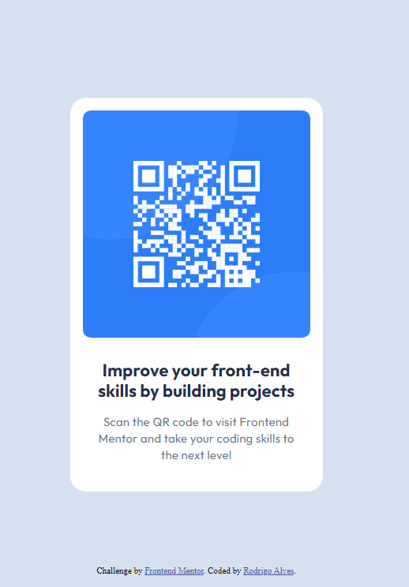

# Frontend Mentor - QR code component solution

This is a solution to the [QR code component challenge on Frontend Mentor](https://www.frontendmentor.io/challenges/qr-code-component-iux_sIO_H). Frontend Mentor challenges help you improve your coding skills by building realistic projects. 

## Table of contents
  - [Screenshot](#screenshot)
  - [Links](#links)
  - [Built with](#built-with)
  - [What I learned](#what-i-learned)
  - [Continued development](#continued-development)
  - [Author](#author)

### Screenshot

()

### Links

- Solution URL: [Add solution URL here](https://www.frontendmentor.io/solutions/i-used-plain-css-and-html-JeqEqJcvHH)
- Live Site URL: [Add live site URL here](https://rodrigoo-alves.github.io/qr-code-component-main/)

### Built with

- Semantic HTML5 markup
- CSS custom properties
- Flexbox

### What I learned

I learned Responsive CSS using a good amount of html tags

### Continued development

I want to improve my CSS style so I can make webpages styles more easly

## Author

- Website - [Add your name here](https://www.your-site.com)
- Frontend Mentor - [@rodrigoo-alves](https://www.frontendmentor.io/profile/yourusername)
